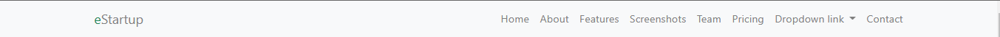
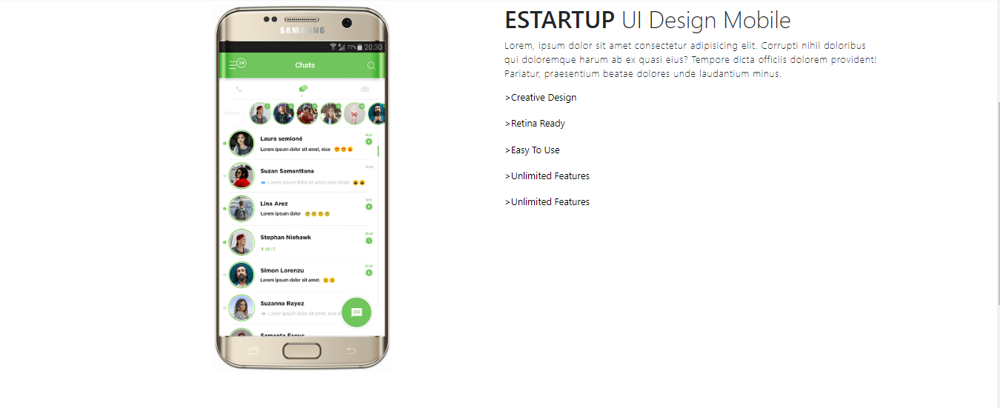
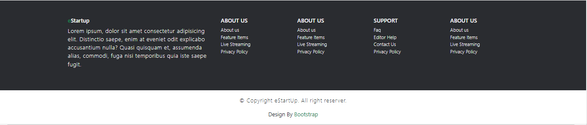

# Bootstrap

## Resume Materi Bootstrap

1. Bootstrap adalah framework web development gratis dan open-source yang dirancang untuk memudahkan proses pengembangan web responsif dan mobile-first (memprioritaskan perangkat seluler), dengan menyediakan berbagai syntax untuk desain template.
2. Instalasi Bootstrap bisa dengan 2 cara yaitu yang pertama dengan menggunakan quickstart template dari bootstrap sehingga bisa langsung digunakan tetapi harus dalam keadaan online sedangkan dengan cara mendownload file css dan js, kita harus ekstrak foldernya lalu import file css dan js nya.
3. Bootstrap memanfaatkan sebuah class dalam styling nya sehingga memudahkan dalam styling.

## Screenshot Hasil Praktikum

1. Membuat Sebuah Navbar yang responsive
   

2. Membuat body dengan content utama
   
   

3. Membuat Footer responsive
   

4. Full tampilan
   
   
