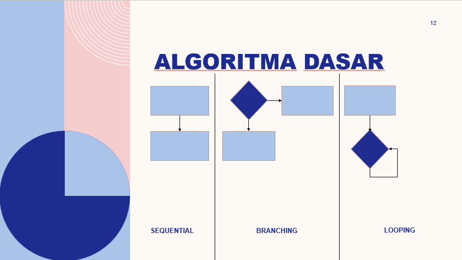
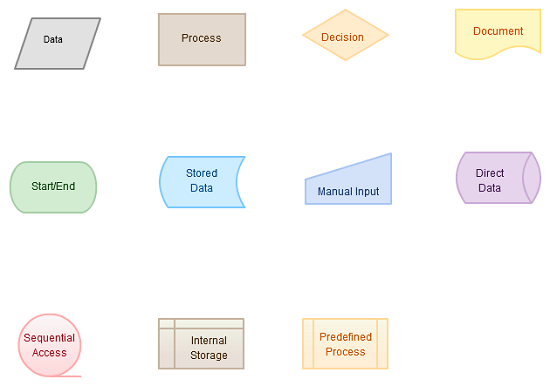

# Introduction Algorithm

### Resume Introduction Algorithm

> Algoritma dibutuhkan oleh seorang programmer, karena dalam kasusnya pada pembangunan sebuah aplikasi, seorang programmer selalu dihadapkan oleh permasalahan-permasalahan yang harus diselesaikan, maka kemampuan dalam memahami algoritma sangat penting untuk seorang Programmer atau Developer.

#### 1. Algoritma

Algoritma merupakan sebuah prosedur komputasi yang didefinisikan dengan baik dengan mengambil beberapa nilai sebagai input dan mengambil beberapa nilai akhir sebagai output.

#### 2. Karakteristik Algoritma

- Memiliki Batas (awal dan akhir)
- Intruksi terdefinisi dengan baik
- Efektif dan Efisien

#### 3. Algoritma Dasar

- Sequencial
- Branching
- Looping
  

#### 4. Pseudecode

Pseudecode merupakan deskripsi bahasa sederhana yang bisa digunakan untuk menuangkan inde algoritma.

#### 5. Flowchart

Flowchart merupakan sebuah bagan dengan simbol tertentu yang menggambarkan hubungan atau urutan dari suatu program

