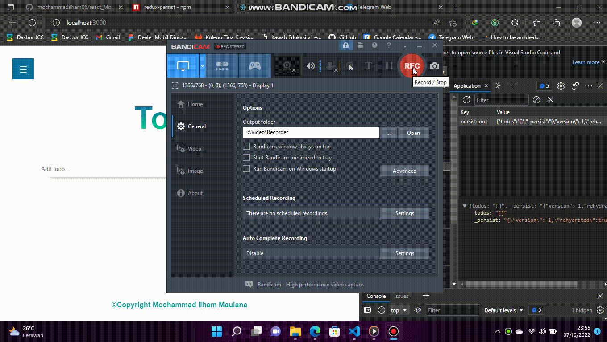

# Global State Management and Data Fetching

### Resume Global State Management and Data Fetching

### 1. Introduction of Global State Management

> Global State management digunakan ketika kita membutuhkan state yang sama di component yang berbeda, hal ini memudahkan dalam pengembangan aplikasi website, contoh dari Global State management adalah `Redux`

- #### When use Redux (library Redux)?

1. Banyak state yang ditaruh di banyak tempat

2. State pada app sering berubah

3. Logic untuk mengubah state kompleks

4. Ukuran codebase yang sedang-besar, dan dikerjakan oleh banyak orang

5. Perlu untuk mengetahui bagaimana state di update seiring dengan waktu

- #### Redux Libraries and Tools

1. `React-Redux`
2. `Redux Toolkit`
3. `Redux DevTools Ekstention`

- #### Komponen Penting Redux

1. `Actions` digunakan untuk memberikan informasi dari aplikasi ke `store`
2. `Reducer` merupakan JS Function yang mengambil state aplikasi saat ini dan object action lalu mengembalikan state aplikasi terbaru
3. `Store` merupakan objek sentral yang menyimpan state pada aplikasi

- #### Cara menggunakan Redux Store

```jsx
//import Provider dari react-redux
import {Provider} from "react-redux"

//Panggil fungsi Provider nya
ReactDOM.render(
<Provider store = {store}>
<App/>
</Provider>
document.getElementById('root')
)

```

### 2. Redux Thunk

> Redux Thunk merupakan **middleware** untuk redux yang memungkinkan kita membuat **action creator** yang mengembalikan `function` bukan **action**

```jsx
//Import redux thunk
import { createStore, applyMiddleware } from "redux";
import thunk from "redux-thunk";
import rootReducer from "./reducers/index";

const store = createStore(rootReducer, applyMiddleware(thunk)); //diakses di bagian action

//Contoh penggunaan Redux Thunk
const INCREMENT_COUNTER = "INCREMENT_COUNTER";
function Increment() {
  return {
    type: INCREMENT_COUNTER,
  };
}

//function Thunk
function IncrementAsync() {
  return (dispatch) => {
    setTimeout(() => {
      dispatch(Increment());
    }, 1000);
  };
}
```

### 3. Persisted State

> Redux Persist merupakan library dari keluarga redux yang berguna untuk menyimpan state

```jsx
//Import

import { createStore, applyMiddleware } from "redux";
import { persistStorage, persistReducer } from "redux-persist"; //import dari redux-persist

import storage from "redux-persist/lib/storage"; //default Local storage

import rootReducer from "./reducers"; //Lokasi Root dari Reducer

//Konfigurasi redux persist
const persistConfig = {
  key: "root",
  storage, //definisi storage mana yang digunakan
};

const persistReducer = persistReducer(persistConfig, rootReducer); //Buat persist reducer

const store = createStore(persistReducer, applyMiddlerware());

const persistor = persistStore(store);

export { stroe, persistor };
```

```jsx
//cara panggil di App nya
import {store, persistor} from './redux/store' //lokasi file store
import {persistGate} from 'redux-persist/integration/react'

const App = () =>{
return(
<Provider store = {store}>
<PersistGate loading = {null} persistor={persistor}
<RootComponent/>
</PersistGate>
</Provider>
)
}
```

### 4. Data Fetching

> Merupakan proses pengambilan data dari Server ke Aplikasi kita

- #### Cara Fetching data di React

1. Fetch API
2. Axios
3. React Query Library

```js
//contoh penggunaan Fetch API
fetch("link-here", {
  method: "get",
})
  .then(function (response) {})
  .catch(function (err) {
    //error here
  });
```

- #### Object yang sering digunakan
  | Request     | List                         |
  | ----------- | ---------------------------- |
  | method      | GET, POST, PUT, DELETE, HEAD |
  | url         | URL dari Request             |
  | body        | Body dari Request            |
  | headers     | Objek dari Headers           |
  | referre     | Referre dari request         |
  | mode        | cors, no-cors, same-origin   |
  | credentials | amit, same-origin            |
  | redirect    | follow, error, manual        |
  | integrity   | subresource integrity value  |
  | cache       | cache mode(default, reload)  |

## Result Praktikum Global State Management and Data Fetching

### **Soal 1**


