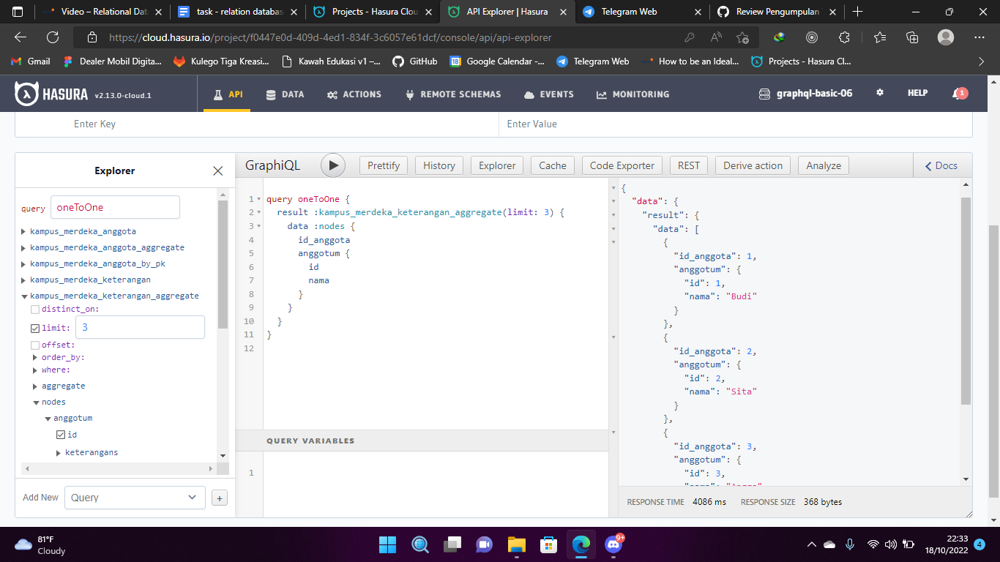
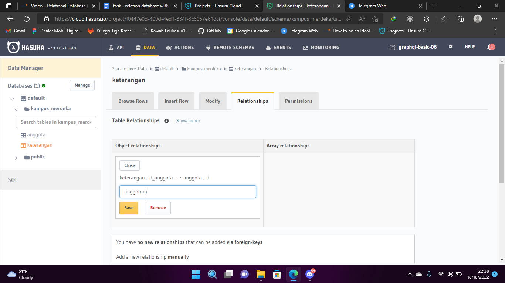
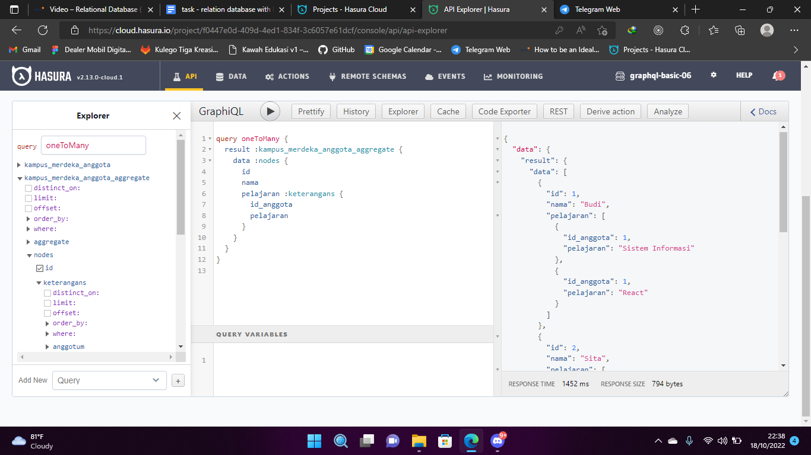
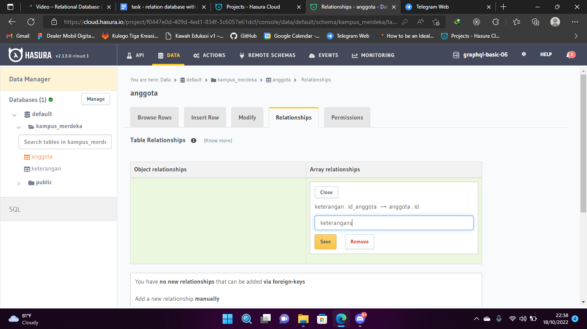

# Relational Database

### Resume Relational Database

### 1. Database?

> Database merupakan sekumpulan data yang terorganisir

### 2. Schema Database

> Schema Databse merupakan istilah untuk menyebut struktur atau tata letak yang menjabarkan suatu rangkaian data. Dengan kata lain, Schema Database mendeskripsikan bagaimana data akan diatur dan dihubungkan.

### 3. Relational Database

> Database Relationship Merupakan sebuah hubungan antara entity dalam database. Dalam Database relationship dibagi mennjadi 3 yaitu :

| Relation     | Description                                                                                                                          |
| ------------ | ------------------------------------------------------------------------------------------------------------------------------------ |
| One to One   | Merupakan konsep dimana satu table hanya dapat membuat atau melakukan action sebanyak 1 kali pada table lain.                        |
| One to Many  | Merupakan konsep relation dimana 1 table dapat membuat banyak action pada table lain, contohnya 1 user dapat membuat banyak post     |
| Many to Many | Merupakan konsep dimana banyak data pada table dapat membuat banyak action dengan banyak data pada table lain begitupun kebalikannya |

### Result

1. One To One
   
   

2. One To Many
   
   
